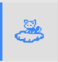

# Kutespaces Inspector

The **Kutespace inspector** is your command center. Click on the **Kutespaces Icon** in the side bar to open it.

# *Resources* Panel

* Jump to the *README* and *Tutorial*.
* Browse links to helpful resources such as documentation.

# *Mission* Panel

* Start the next mission.
* Lists the tasks you need to complete to finish the mission.
